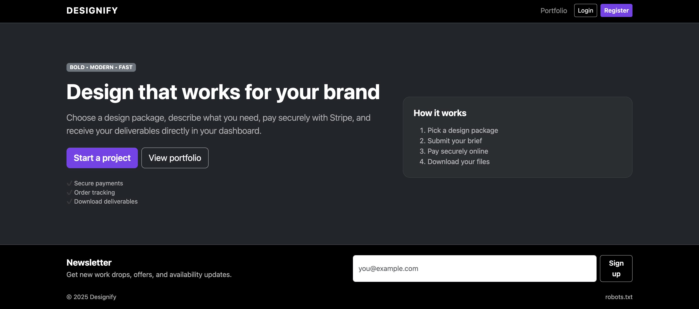
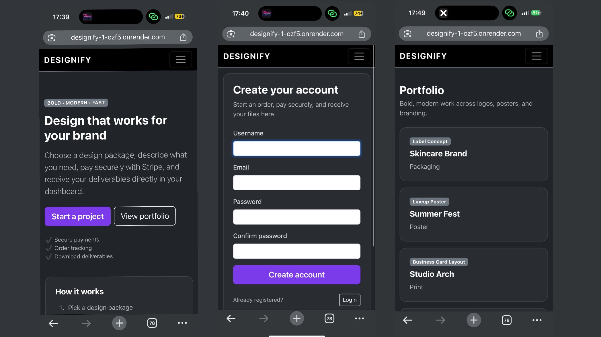

# Designify

Designify is a full-stack Django e-commerce web application for purchasing graphic design service packages. Users can create an account, submit a design brief, receive a server-side quote, and pay securely via Stripe (test mode). Staff can manage orders and upload deliverables for customers to download.

### Desktop



### Mobile



**Live site:** https://designify-1-ozf5.onrender.com

---

## Project Goals

### User Goals
- View portfolio examples before purchasing
- Choose a package and submit a clear brief
- Pay securely and see payment feedback
- Access deliverables once uploaded

### Site Owner Goals
- Sell design service packages
- Collect structured briefs and requirements
- Manage orders and deliverables in a staff dashboard
- Build brand reach via newsletter and social presence

---

## E-commerce Business Model
Designify uses a **service-based, single-payment model**:
- Users purchase predefined design packages
- Pricing is determined on the server (not editable in the browser)
- Payments are processed through Stripe Checkout
- Deliverables are uploaded by staff and made available to the customer

## User Stories 

### Must Have
1. As a visitor, I can view the homepage and understand the service offering.
2. As a visitor, I can browse a portfolio list and open portfolio details.
3. As a visitor, I can register for an account.
4. As a user, I can log in/out and see my login state reflected in navigation.
5. As a user, I can create an order by selecting a package and submitting a brief.
6. As a user, I can view my orders and open each order detail page.
7. As a user, I can pay for an order via Stripe Checkout.
8. As a user, I receive clear success/cancel feedback after payment.
9. As staff, I can view all orders in an admin dashboard.
10. As staff, I can upload deliverables linked to an order.
11. As staff, I can remove a deliverable if needed.

### Should Have
12. As staff, I can filter/search orders.
13. As a visitor, I can sign up to a newsletter.

### Could Have
14. Email notifications for payment and deliverables.
15. Subscription model for ongoing design work.

---

## Features

### Public
- Homepage with CTA
- Portfolio list + detail pages
- Newsletter signup

### Authentication & Authorisation 
- Registration + login
- Login/register restricted to anonymous users
- Staff-only admin order management pages

### Orders (CRUD) 
- Users can create and manage their orders
- Staff can manage orders and deliverables

### Payments (Stripe)
- Stripe Checkout integration (test mode)
- Feedback pages/messages for successful and unsuccessful payments

### SEO 
- Meta descriptions and site title
- All pages reachable via internal links/navigation
- sitemap.xml and robots.txt
- Custom 404 page
- No lorem ipsum

---

## Database Design 
Custom models include:
- DesignPackage
- DesignOrder
- PortfolioItem
- Testimonial
- NewsletterSubscriber
- Deliverable

Relationships:
- A User has many Orders
- An Order belongs to a Package
- An Order can have many Deliverables

---

## Technologies Used
- HTML, CSS, Bootstrap 5
- Python, Django
- Stripe (test mode)
- Cloudinary (media storage)
- Whitenoise (static files)
- Render (deployment)

---

## Testing 

### Manual Testing Checklist
- Register: validation + success flow
- Login/Logout: redirects + nav state
- Create order: form validation + CRUD
- Payment: Stripe redirect + cancel/success feedback
- Authorisation: staff only pages blocked for non staff
- Responsive layout: mobile and desktop checks

## Deployment (Render)

### Deployment Steps
1. Create a Render Web Service linked to the GitHub repository.
2. Set Build Command:
   ```bash
   pip install -r requirements.txt && python manage.py collectstatic --noinput && python manage.py migrate
3. Set Start Command:
   ```bash
   gunicorn config.wsgi:application
4. Set Environment Variables on Render:
- SECRET_KEY
- DEBUG=False
- ALLOWED_HOSTS=designify-1-ozf5.onrender.com,www.designify-1-ozf5.onrender.com
- STRIPE_PUBLIC_KEY
- STRIPE_SECRET_KEY
- CLOUDINARY_URL 

## Marketing

### Newsletter
Users can submit their email address via the newsletter form.

### Social Media Mockups
Screenshots of the social media mockups are included below.

- Designify Facebook Page

A Facebook Business Page mockup was created to demonstrate how Designify would be marketed on social media.  
This approach was chosen instead of a live Facebook page to avoid issues with platform moderation and deletion of test pages.


## Credits
- Django documentation
- Bootstrap documentation
- Stripe documentation
- Cloudinary Documentation


