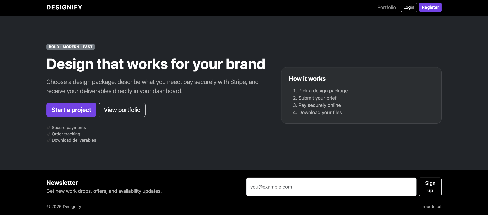
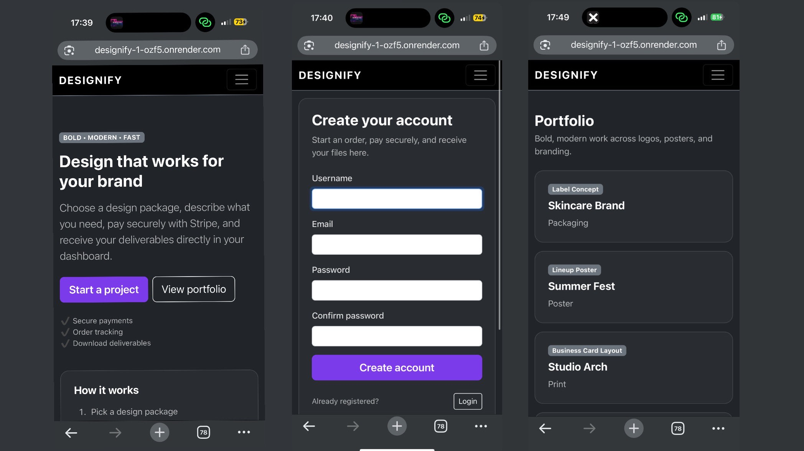
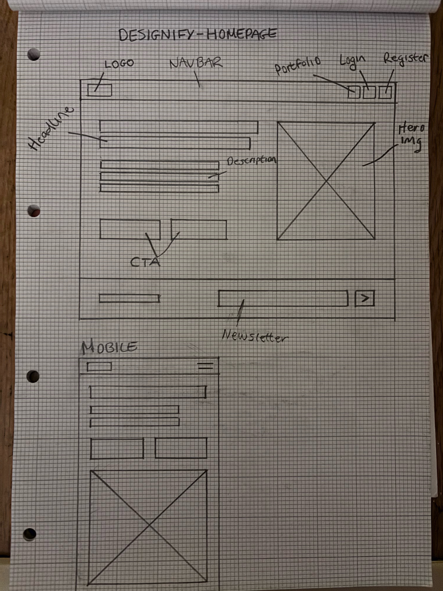
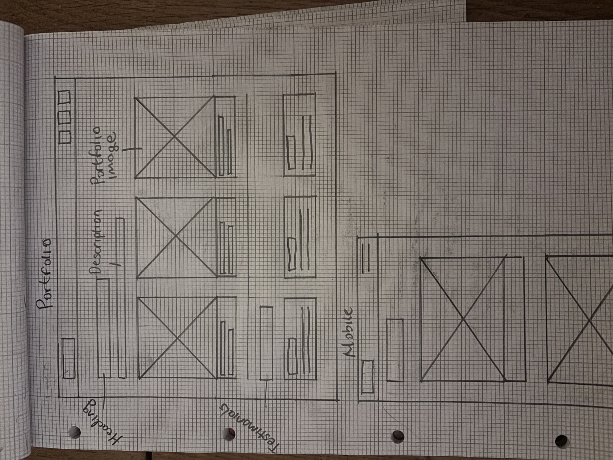
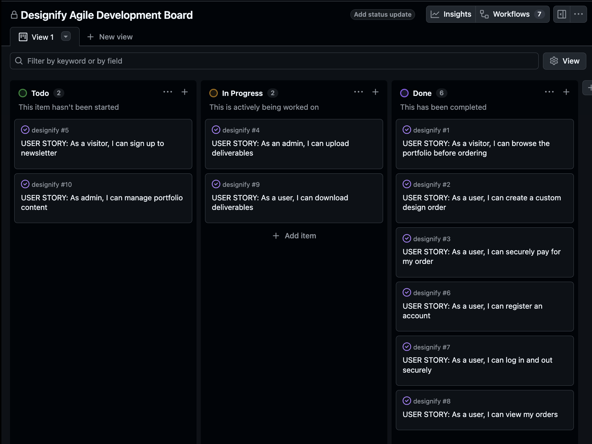

# Designify

Designify is a full-stack Django e-commerce web application for purchasing graphic design service packages. Users can create an account, submit a design brief, receive a server-side quote, and pay securely via Stripe (test mode). Staff can manage orders and upload deliverables for customers to download.

### Desktop

### Mobile

**Live site:** https://designify-1-ozf5.onrender.com

---

## Project Goals

### User Goals
- View portfolio examples before purchasing
- Choose a package and submit a clear brief
- Pay securely and see payment feedback
- Access deliverables once uploaded

### Site Owner Goals
- Sell design service packages
- Collect structured briefs and requirements
- Manage orders and deliverables in a staff dashboard
- Build brand reach via newsletter and social presence

---

## E-commerce Business Model

Designify operates as a **B2C (Business-to-Consumer)** service-based e-commerce platform.

The purpose of the site is to allow individual users and small business owners to purchase custom design services online.

The revenue model is based on **single one-time payments** for design packages such as branding, social media kits, promotional graphics, and bespoke creative deliverables.

Users browse available portfolio work and select a design package that best suits their needs. They then submit a custom brief and complete payment through Stripe.

The business creates value by:
- providing professional design services online
- streamlining the custom order process
- allowing direct communication of user requirements
- enabling digital delivery of completed design assets

The target market includes:
- small businesses
- influencers and creators
- independent musicians and artists
- startups
- personal branding clients

This model is primarily focused on **digital service sales**, rather than physical product sales.

---

## User Stories 

### Must Have
1. As a visitor, I can view the homepage and understand the service offering.
2. As a visitor, I can browse a portfolio list and open portfolio details.
3. As a visitor, I can register for an account.
4. As a user, I can log in/out and see my login state reflected in navigation.
5. As a user, I can create an order by selecting a package and submitting a brief.
6. As a user, I can view my orders and open each order detail page.
7. As a user, I can pay for an order via Stripe Checkout.
8. As a user, I receive clear success/cancel feedback after payment.
9. As staff, I can view all orders in an admin dashboard.
10. As staff, I can upload deliverables linked to an order.
11. As staff, I can remove a deliverable if needed.

### Should Have
12. As staff, I can filter/search orders.
13. As a visitor, I can sign up to a newsletter.

### Could Have
14. Email notifications for payment and deliverables.
15. Subscription model for ongoing design work.

---

## Features

### Public
- Homepage with CTA
- Portfolio list + detail pages
- Newsletter signup

### Authentication & Authorisation 
- Registration + login
- Login/register restricted to anonymous users
- Staff-only admin order management pages

### Orders (CRUD) 
- Users can create and manage their orders
- Staff can manage orders and deliverables

### Payments (Stripe)
- Stripe Checkout integration (test mode)
- Feedback pages/messages for successful and unsuccessful payments

### SEO Implementation
The project includes multiple SEO-focused features to improve visibility and indexing:

- custom page titles
- custom meta descriptions
- robots.txt
- sitemap.xml
- bespoke 404 page
- internal linking through navigation and footer links
- use of rel attributes for external links

---

## UX Design

The purpose of Designify is to provide users with a clean and straightforward platform to purchase custom design services online.

The target audience includes:
- small business owners
- content creators
- independent artists
- professionals requiring branding or promotional design work

The user journey was designed to be simple:
1. View portfolio work
2. Select a package
3. Submit design brief
4. Pay securely
5. Receive deliverables

### Design Process

The interface was planned with a strong focus on user journey and clarity.

Key goals included:
- easy portfolio browsing
- quick package selection
- clear checkout flow
- intuitive admin order management

### Wireframes and Design Planning

Initial wireframes were created to plan page layout, user flow, and content hierarchy before development.

#### Homepage Wireframe

 
#### Portfolio Wireframe

---

## Agile Planning

The project was developed using Agile methodology principles.

GitHub Issues were used to define user stories and acceptance criteria for each major feature.

A GitHub Project Board was used to organise development tasks into:
- Todo
- In Progress
- Done

This allowed features to be planned, prioritised, and tracked throughout development.

### Agile Development Board

---

## Database Schema
The application uses a relational database structure with clear model relationships.

Key models include:
- `DesignPackage`
- `DesignOrder`
- `PortfolioItem`
- `Testimonial`
- `NewsletterSubscriber`
- `Deliverable`

Relationships:
- One user can create multiple design orders
- Each order belongs to one package
- Each order can have multiple deliverables

---

## Technologies Used
- HTML, CSS, Bootstrap 5
- Python, Django
- Stripe (test mode)
- Cloudinary (media storage)
- Whitenoise (static files)
- Render (deployment)

---

## Testing 

### Manual Testing

| Feature | Test Performed | Expected Result | Outcome |
|---|---|---|---|
| User Registration | Created new account with valid details | User account created and redirected | Pass |
| Login | Logged in with valid credentials | User redirected to homepage/dashboard | Pass |
| Logout | Clicked logout button | User logged out and redirected | Pass |
| Create Order | Submitted design brief form | Order created in database | Pass |
| Edit Order | Updated existing draft order | Changes saved and reflected in frontend | Pass |
| Delete Order | Deleted draft order | Order removed from database | Pass |
| Stripe Payment | Proceeded to test checkout | Redirected to Stripe checkout page | Pass |
| Payment Success | Used successful Stripe test card | Payment marked successful | Pass |
| Payment Cancel | Cancelled Stripe checkout | User returned with feedback message | Pass |
| Deliverable Upload | Admin uploaded design file | Deliverable visible to user | Pass |
| Portfolio Page | Loaded portfolio items | Items displayed correctly | Pass |
| Newsletter Signup | Submitted email | Subscriber saved successfully | Pass |
| Responsive Design | Tested mobile + desktop | Layout adapts correctly | Pass |

### Validation Testing
- HTML pages tested through W3C validator
- CSS tested through W3C validator
- Python code checked for PEP8 compliance
- Forms tested for invalid inputs and error messaging

---

## Deployment 

The application is deployed using Render.

### Deployment Process
1. The project was pushed to GitHub.
2. A new Render Web Service was created.
3. The GitHub repository was linked to Render.
4. Environment variables were configured:
   - SECRET_KEY
   - DEBUG
   - ALLOWED_HOSTS
   - STRIPE keys
   - CLOUDINARY_URL
5. Static files are served using WhiteNoise.
6. Media files are stored using Cloudinary.
7. The application was deployed successfully and tested on the live URL.

### Security
Sensitive information such as API keys and secret keys are stored securely using environment variables and are excluded from version control using `.gitignore`.

---

## Known Issues & Limitations

During deployment on Render's free tier, the SQLite database may reset on redeploy due to the ephemeral file system.

In a production environment, this would be resolved using PostgreSQL or a persistent disk.

---

## Marketing

### Newsletter
Users can submit their email address via the newsletter form.

### Social Media Mockups
Screenshots of the social media mockups are included below.

- Designify Facebook Page

A Facebook Business Page mockup was created to demonstrate how Designify would be marketed on social media.  
This approach was chosen instead of a live Facebook page to avoid issues with platform moderation and deletion of test pages.

## Credits
- Django documentation
- Bootstrap documentation
- Stripe documentation
- Cloudinary Documentation

